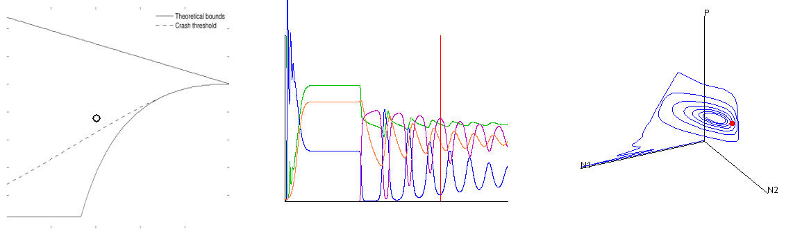
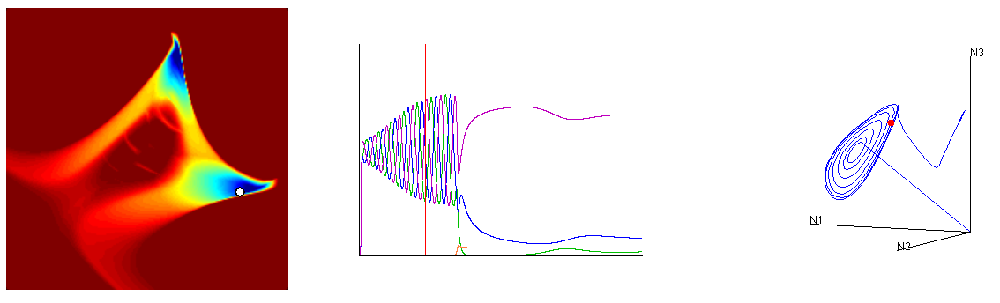
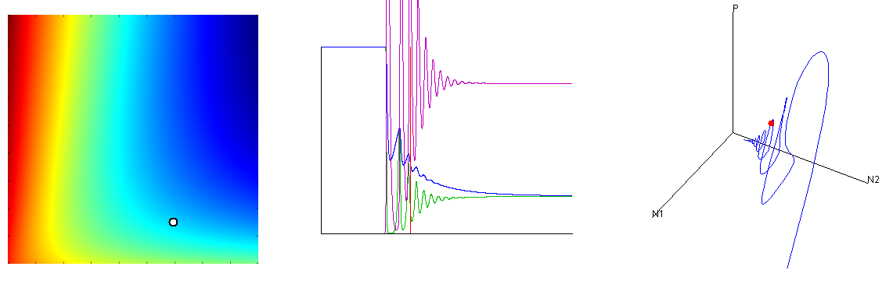

# How to use the applet

With the [JDK](http://www.oracle.com/technetwork/java/javase/downloads/index.html) installed, type ``appletviewer demo0.html`` at a command line. 

The applet has three panels. In the leftmost, you can click to set two parameters for the eclogical model, which may dramatically affect ts behavior. When new parameters are chosen, the other two panels will update. 

The middle panel shows a time series for a resource, two herbivore species that feed on it, and a predator (the predator is in violet). You may click in this panel to select a particular moment to be highlighted (shown by a red vertical line).

In the third panel, the prey and predator numbers are plotted as a three-dimensional trajectory. This plot can be rotated by clicking and dragging. Also, you may press buttons 1-3 to view the dynamics in two dimensions. For example, pressing 2 will show the dynamics of prey 1 versus the predator.

If you type ``appletviewer demo1.html`` at a command line...

The applet is very similar, except this model shows three prey species and a predator (again in violet).

If you type ``appletviewer demo2.html`` at a command line...

Again, the applet is very similar, with two prey species and a predator (in violet).
